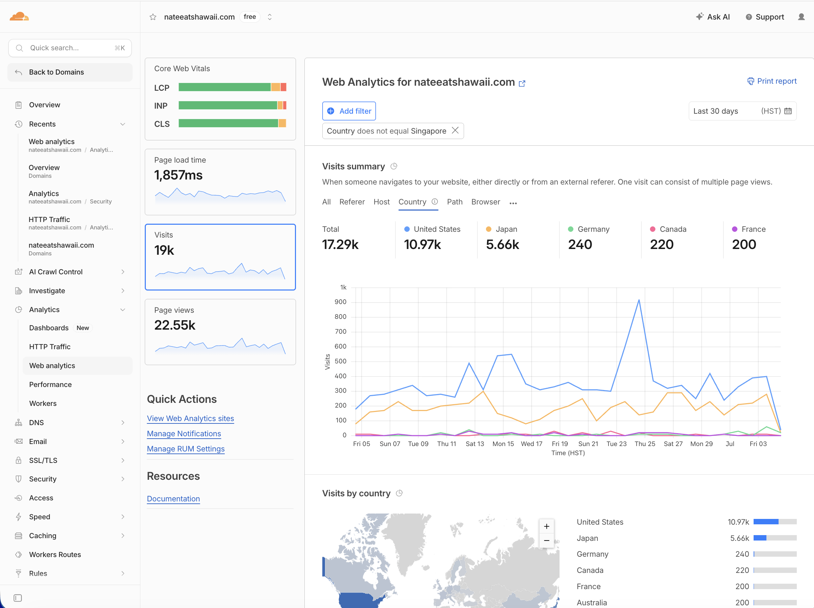

# Bilingual content pipeline — nateeatshawaii.com

The publishing and translation system behind [NateEatsHawaii](https://nateeatshawaii.com), a bilingual (English/Japanese) Oahu restaurant guide serving **17,000+ monthly visitors** with page-one Google rankings for competitive Honolulu dining keywords.

The Japanese content produced by this pipeline drives **roughly a third of all site traffic**:



This repo contains the two production scripts, extracted from the site's private codebase. They reference the parent Next.js app's structure (`lib/articles.ts`, `app/[locale]/…`), so read them as production source, not a drop-in CLI.

## What it does

Publishing a new article is: author 4 files, run 2 commands.

```
translations/en/<slug>.json      ──┐
                                   ├─►  npm run translate      (Claude API → translations/jp/<slug>.json)
app/[locale]/<slug>/page.tsx     ──┤
public/images/articles/<slug>/*  ──┴─►  npm run publish-article (validate → face-blur → watermark →
                                        register everywhere → Food Map page → review JSON-LD)
```

### `scripts/translate.ts` — Claude-powered EN→JP translation

- Domain-specific system prompt: restaurant names stay in English, Hawaiian food terms get katakana (ポケ, マラサダ, シェイブアイス), place names stay recognizable to Japanese travelers, SEO keywords are translated to natural Japanese search terms — not transliterated.
- Structure-preserving: the model returns the same JSON shape with English keys, so the same `ArticleTemplate` component renders both locales.
- Output is parsed and validated as JSON before anything is written; failures never ship.
- Idempotent (skips already-translated files) and rate-limited between calls.

### `scripts/publish-article.mjs` — one-command publish

Auto-detects any dropped-in article (or takes a slug), then:

1. **Schema validation** — hard-stops a wrong-shape article before it ships broken; warns on SEO titles over 60 chars.
2. **Face blur (privacy)** — detects and blurs every face in every photo via OpenCV YuNet, with a `keepFaces` exception that preserves only the largest face (the author) in listed images. Blurred-crowd photos are also kept out of restaurant page galleries.
3. **Image processing** — auto-rotate, resize ≤1000px, bake the site watermark, compress under 200KB, write EXIF copyright. Already-processed files are detected by their EXIF marker and skipped.
4. **Face-free cover pick** — if the social/OG image is unset or contains a face, swaps in the first face-free image.
5. **Registration cascade** — one anchored insert into the article registry propagates to the homepage feed (EN + JP), the announcement bar, search, related articles, and the sitemap. No manual wiring.
6. **Food Map integration** — links the article to an existing restaurant page (back-link, gallery merge, menu copy) or creates a new one from the article's metadata.
7. **Review JSON-LD** — rated reviews get critic-review structured data for star rich results.

Flags: `--dry-run` (plan without writing), `--no-blur` (skip face steps).

Full workflow documentation: [`docs/PUBLISHING.md`](docs/PUBLISHING.md).

## Engineering notes

- **Idempotent by design.** Re-running is always safe: EXIF markers prevent double watermarks, registry checks prevent duplicate entries, existing restaurant slugs are never overwritten. Adding photos to a published article is "drop files, run again."
- **Fail closed.** Invalid JSON, a wrong article schema, or an unparseable translation stops that article without publishing a broken page — a hard-stop is cheaper than a live page with no title.
- **Graceful degradation.** If the Python/OpenCV face stack is missing, the face steps skip with a warning and everything else still runs.
- **Model choice as a cost decision.** Translation runs at publish time, a handful of times per month, and its quality directly affects Japanese SEO — so it uses a top-tier Claude model and costs cents per article. Runtime, per-request features are built on smaller, cheaper models. Routing by workload is the whole cost strategy.

## Results

- 17,000+ monthly visitors; page-one rankings for competitive Honolulu dining keywords
- Japanese-language pages account for ~⅓ of all visits (5.7k of 17.3k in the last 30 days)
- Hundreds of bilingual pages published and maintained by one person

## Scope, honestly

- Article authoring is human work (with AI assistance) — the pipeline owns translation and publishing, not writing.
- Runs locally on demand, not on CI; deploys ride the normal `git push` → Render build.
- Face blur is best-effort computer vision, and processed images are reviewed before shipping.

## Author

**Nejc (Nate) Anisco** — full-stack & AI engineer, Honolulu
[nateeatshawaii.com](https://nateeatshawaii.com) · [LinkedIn](https://www.linkedin.com/in/nejc-anisco/) · [GitHub](https://github.com/HiNateK)
